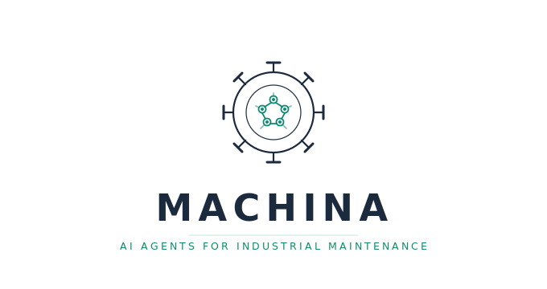

<div align="center">
  
  <h1>Machina</h1>
  <p><strong>Build AI agents for industrial maintenance in a few lines of Python.</strong></p>
  <p>
    <a href="https://opensource.org/licenses/Apache-2.0"></a>
    <a href="https://www.python.org/downloads/"></a>
    <a href="https://pypi.org/project/machina-ai/"></a>
    <a href="https://github.com/LGDiMaggio/machina/actions"></a>
    <a href="https://pypi.org/project/machina-ai/"></a>
  </p>
  <p>
    <a href="#quick-start">Quick Start</a> &bull;
    <a href="#what-you-can-build">Examples</a> &bull;
    <a href="#why-machina">Why Machina</a> &bull;
    <a href="https://machina-ai.readthedocs.io">Docs</a> &bull;
    <a href="#contributing">Contributing</a>
  </p>
</div>

---

## Quick Start

```bash
pip install machina-ai[litellm,docs-rag]
git clone https://github.com/LGDiMaggio/machina.git
cd machina/examples/quickstart
python agent.py
```

> **LLM provider required.** Choose one:
>
> | Provider | Setup |
> |----------|-------|
> | **Ollama** (local, free) | Install from [ollama.com](https://ollama.com), then `ollama pull llama3` |
> | **OpenAI** | `export OPENAI_API_KEY=sk-...` |
> | **Anthropic** | `export ANTHROPIC_API_KEY=sk-ant-...` |
>
> Override the default with `python agent.py --llm openai:gpt-4o` or `--llm anthropic:claude-sonnet-4-20250514`.

The agent is built in 13 lines:

```python
from pathlib import Path

from machina import Agent, Plant
from machina.connectors.cmms import GenericCmmsConnector
from machina.connectors.docs import DocumentStoreConnector
from machina.connectors.comms.telegram import CliChannel

SAMPLE_DIR = Path(__file__).resolve().parent.parent / "sample_data"

agent = Agent(
    name="Maintenance Assistant",
    plant=Plant(name="Demo Plant"),
    connectors=[
        GenericCmmsConnector(data_dir=SAMPLE_DIR / "cmms"),
        DocumentStoreConnector(paths=[SAMPLE_DIR / "manuals"]),
    ],
    channels=[CliChannel()],
    llm="ollama:llama3",  # or "openai:gpt-4o", "anthropic:claude-sonnet"
)
agent.run()
```

Sample data included: 6 assets, 5 work orders, 6 spare parts, 10 failure modes, 2 equipment manuals. Your technicians can now talk to their plant data:

```
You: What is the bearing replacement procedure for pump P-201?

Agent: Based on the Grundfos CR 32-2 maintenance manual for P-201:
1. Lock out/tag out and isolate power supply
2. Drain the pump casing, disconnect piping
3. Extract drive-end bearing (SKF 6310-2RS) using a bearing puller
4. Press-fit new bearing using induction heater (110 C)
5. Reassemble, torque cover bolts to 45 Nm
6. Verify vibration per ISO 10816-3 after commissioning
Recommended spare: SKF 6310-2RS (in stock: 4 units)

You: Are there open work orders on that pump?

Agent: Yes, one corrective work order for P-201:
  WO-2026-0087 | Priority: HIGH | Bearing replacement
  Status: Scheduled | Assigned to: Maintenance Team A

You: Create a predictive work order for bearing replacement, priority HIGH

Agent: Work order created:
  WO-2026-0412 | Type: PREDICTIVE | Priority: HIGH
  Asset: P-201 (Cooling Water Pump)
  Description: Replace drive-end bearing based on elevated vibration.
  Spare parts: SKF 6310-2RS reserved (1 of 4 in stock)
```

The agent resolves "pump P-201" to the actual asset, retrieves context from your CMMS, searches manuals via RAG, and takes action -- grounded in real data, not hallucinated.

Try it now: `cd examples/quickstart && python agent.py` -- [full quickstart guide](examples/quickstart/)

### Or configure via YAML

For knowledge-base agents (Q&A over CMMS data, manuals, spare parts), you can skip Python entirely and configure via YAML:

```yaml
name: "Maintenance Assistant"
plant:
  name: "North Plant"
connectors:
  cmms:
    type: generic_cmms
    settings:
      data_dir: "./sample_data/cmms"
  docs:
    type: document_store
    settings:
      paths: ["./sample_data/manuals"]
channels:
  - type: cli
llm:
  provider: "ollama:llama3"
```

```python
from machina import Agent

agent = Agent.from_config("machina.yaml")
agent.run()
```

YAML config is ideal for knowledge-base agents — technician Q&A, document search, asset lookup. For agents with automated workflows (alarm response, predictive pipelines), use Python — workflows need logic (guards, error policies, LLM reasoning steps) that YAML can't express. See the [YAML config guide](examples/06_yaml_config/) for details.

## What You Can Build

Every example is a complete, runnable agent. Start with quickstart, then pick what matches your use case:

| | Example | What your agent does |
|-|---------|---------------------|
| **Start here** | [quickstart/](examples/quickstart/) | Answers questions about equipment, procedures, spare parts, maintenance history |
| **Automate** | [01_alarm_response/](examples/01_alarm_response/) | Alarm fires -- agent diagnoses the failure, checks parts, creates a work order, notifies the team via CLI (and optionally SMTP via `EmailConnector`) |
| **Go autonomous** | [02_predictive_pipeline/](examples/02_predictive_pipeline/) | 10-step pipeline: sensor anomaly to diagnosed root cause to scheduled maintenance. 3 LLM steps, 7 deterministic |
| **Stay portable** | [03_cmms_portability/](examples/03_cmms_portability/) | Same agent runs on SAP PM, IBM Maximo, UpKeep -- change one line, everything else stays identical |
| **Build your own** | [04_custom_workflows/](examples/04_custom_workflows/) | Define any maintenance process as a workflow: spare part reorder, preventive scheduling, anything |
| **Zero code** | [06_yaml_config/](examples/06_yaml_config/) | Configure agent entirely via YAML -- `Agent.from_config("machina.yaml")` |
| **Think & act** | [07_agent_driven/](examples/07_agent_driven/) | Agent receives a complex scenario and autonomously decides which tools to use -- no predefined workflows |
| **Collaborate** | [05_multi_agent_team/](examples/05_multi_agent_team/) | Specialist agents (diagnostics, inventory, scheduling) collaborate on complex scenarios -- *v0.3* |

All examples run with `ollama:llama3` -- local, free, no API key needed. Override: `--llm openai:gpt-4o`

## Starter Kit

Ready to deploy? The **odl-generator-from-text** template is a complete, clone-configure-deploy package:

```bash
cp -r templates/odl-generator-from-text my-agent
cd my-agent
cp .env.example .env    # fill in your LLM key
docker compose up       # sandbox mode by default
```

A technician sends an email or Telegram message in Italian:

> *"pompa P-201 perde acqua, caldaia C-3 rumore anomalo, prego creare OdL"*

The agent parses the text, resolves assets, creates Work Orders, and replies with confirmation. Supports Excel and REST CMMS substrates. [Full template guide &rarr;](templates/odl-generator-from-text/)

## From Demo to Production

The quickstart uses sample data. When you're ready, swap connectors to your real systems -- the agent logic doesn't change:

```python
# Demo (quickstart)                              # Production
GenericCmmsConnector(data_dir="./sample/")  -->   SapPM(url="https://sap.company.com/odata/v4", auth=...)
                                                  Maximo(url="https://maximo.company.com/oslc", auth=...)
DocumentStoreConnector(paths=["./manuals/"])-->   DocumentStoreConnector(paths=["/shared/manuals/"])
CliChannel()                               -->   Telegram(bot_token="...")
"ollama:llama3"                            -->   "openai:gpt-4o"
```

Add sensors when you need predictive maintenance:

```python
from machina.connectors import OpcUA, MQTT

agent = Agent(
    connectors=[cmms, docs, OpcUA(endpoint="opc.tcp://plc:4840", ...)],
    workflows=[alarm_to_workorder],
    llm="openai:gpt-4o",
)
```

Same agent, same workflows. Just more data flowing in.

## Why Machina?

Building an AI maintenance agent today means writing custom connectors for SAP PM, handling OPC-UA subscriptions, defining domain concepts from scratch, and engineering prompts that understand maintenance -- before writing a single line of business logic. **That takes months.**

Machina provides the missing vertical layer between general-purpose frameworks (LangChain, CrewAI) and the industrial maintenance world:

- **Pre-built connectors** for CMMS, IoT sensors, communication platforms, and document stores
- **Canonical maintenance domain model** -- Asset, WorkOrder, FailureMode, SparePart, Alarm with hierarchies and validation
- **Domain-aware AI** -- agents that resolve equipment references, inject maintenance context, and ground answers in real data
- **Rule-based + LLM intelligence** -- deterministic services (`FailureAnalyzer`, `WorkOrderFactory`, `MaintenanceScheduler`) work alongside the LLM, not instead of it
- **Workflow engine** -- composable multi-step workflows with error policies, guard conditions, and sandbox mode
- **LLM-agnostic** -- OpenAI, Anthropic, Mistral, Llama, Ollama, and any LiteLLM-compatible provider
- **Sandbox mode** -- test everything safely with a log-only runtime before connecting real systems

### How It Works Under the Hood

When a user asks *"What's wrong with pump P-201?"*, the agent:

1. **Resolves entities** -- "the pump" or "P-201" maps to the actual Asset with its domain metadata, failure history, and criticality
2. **Gathers context** -- parallel async queries to all connectors: work orders from CMMS, readings from sensors, procedures from manuals (RAG)
3. **Grounds the LLM** -- the retrieved context (real asset data, real inventory, real history) is injected into the prompt, so the LLM reasons with facts, not hallucinations
4. **Takes action** -- workflows mix deterministic steps (rule-based diagnosis, spare part checks) with LLM reasoning (root cause synthesis, work order drafting)

<details>
<summary><strong>Connector Matrix</strong></summary>

### CMMS

| Connector | System | |
|-----------|--------|---|
| `GenericCmms` | Any REST-based CMMS (configurable via schema mapping) | Available |
| `SapPM` | SAP Plant Maintenance (OData v2/v4, OAuth2 + Basic Auth) | Available |
| `Maximo` | IBM Maximo (OSLC/JSON, API key + Basic + Bearer) | Available |
| `UpKeep` | UpKeep CMMS (REST API v2, Session-Token) | Available |
| `MaintainX` | MaintainX | Planned |
| `Limble` | Limble CMMS | Planned |
| `Fiix` | Fiix (Rockwell) | Planned |

### IoT & Industrial Protocols

| Connector | Protocol | |
|-----------|----------|---|
| `OpcUA` | OPC-UA | Available |
| `MQTT` | MQTT / Sparkplug B | Available |
| `Modbus` | Modbus TCP/RTU | Planned |

### Communication & Scheduling

| Connector | Platform | |
|-----------|----------|---|
| `Telegram` | Telegram Bot API | Available |
| `Slack` | Slack Bolt SDK (Socket Mode) | Available |
| `Email` | SMTP / IMAP (+ Gmail API) | Available |
| `Calendar` | Google Calendar / Outlook / iCal | Available |
| `WhatsApp` | WhatsApp Business Cloud API | Planned |
| `Teams` | Microsoft Graph API | Planned |

### Documents & Knowledge

| Connector | Source | |
|-----------|--------|---|
| `DocumentStore` | PDF / DOCX with RAG (LangChain + ChromaDB) | Available |

</details>

## Architecture

```
                    +---------------------------+
                    |   Claude / Cursor / MCP   |
                    +-------------+-------------+
                                  | MCP Protocol
+------------------------------------------------------+
|              YOUR APPLICATION                         |
|  +---------------------+  +------------------------+ |
|  |    AGENT LAYER       |  |    MCP SERVER LAYER    | |
|  | Runtime + Workflows  |  |  (auto-generated from  | |
|  | Domain Prompting     |  |   connector caps)      | |
|  +----------+-----------+  +-----------+------------+ |
+-----------+----------------------------+--------------+
|                    DOMAIN LAYER                        |
|  Asset . WorkOrder . FailureMode . SparePart . Alarm  |
+-------------------------------------------------------+
|                  CONNECTOR LAYER                       |
|  CMMS . IoT . ERP . Communication . Documents         |
+-------------------------------------------------------+
|                    CORE LAYER                          |
|      LLM Abstraction . Config . Observability         |
+-------------------------------------------------------+
```

<details>
<summary><strong>Domain Model</strong></summary>

The domain model is the backbone of Machina. Every connector normalizes external data into domain entities, the agent reasons in domain terms, and LLM prompts are grounded in domain context.

**Why this matters:**

- **Portability** -- Switch CMMS backends, your agent logic doesn't change
- **Deterministic logic where it counts** -- FailureAnalyzer, WorkOrderFactory, MaintenanceScheduler encode expertise as code, not LLM guesses
- **LLM grounding** -- the LLM works with real, validated data (failure codes, maintenance history, inventory levels), not hallucinated IDs
- **Industry-aligned taxonomy** -- failure modes and equipment classes follow established industrial standards

```python
from machina.domain import Asset, AssetType, FailureMode

pump = Asset(
    id="P-201",
    name="Cooling Water Pump",
    type=AssetType.ROTATING_EQUIPMENT,
    criticality="A",
    equipment_class_code="PU",  # ISO 14224 Table A.4
)

bearing_wear = FailureMode(
    code="BEAR-WEAR-01",
    iso_14224_code="VIB",       # ISO 14224 Annex B Table B.15
    name="Bearing Wear",
    mechanism="fatigue",
    typical_indicators=["vibration_velocity_mm_s", "bearing_temperature_c"],
    recommended_actions=["replace_bearing", "check_alignment"],
)
```

The full domain includes: `Asset` (hierarchical trees), `WorkOrder` (lifecycle management), `FailureMode` (ISO 14224 taxonomy), `SparePart` (inventory tracking), `Alarm` (severity-based), `MaintenancePlan` (scheduling), plus three domain services that provide rule-based intelligence alongside the LLM.

</details>

<details>
<summary><strong>Workflow Engine</strong></summary>

Build multi-step maintenance workflows that mix deterministic steps with LLM reasoning:

```python
from machina.workflows import Workflow, Step, Trigger, TriggerType, ErrorPolicy

alarm_to_workorder = Workflow(
    name="Alarm to Work Order",
    trigger=Trigger(type=TriggerType.ALARM, filter={"severity": ["critical"]}),
    steps=[
        Step("diagnose", action="failure_analyzer.diagnose",
             on_error=ErrorPolicy.STOP),
        Step("check_history", action="cmms.read_maintenance_history",
             inputs={"asset_id": "{trigger.asset_id}"},
             on_error=ErrorPolicy.SKIP),
        Step("create_wo", action="work_order_factory.create",
             on_error=ErrorPolicy.STOP),
        Step("notify", action="channels.send_message",
             template="WO created for {trigger.asset_id}: {diagnose}",
             on_error=ErrorPolicy.NOTIFY),
    ],
)

agent = Agent(workflows=[alarm_to_workorder], sandbox=True)
result = await agent.trigger_workflow("Alarm to Work Order", {"asset_id": "P-201"})
```

Or use the built-in template: `from machina.workflows.builtins import alarm_to_workorder`

Features: trigger types (alarm, schedule, manual, condition), error policies (retry/skip/stop/notify), guard conditions, template variables (`{trigger.*}`, `{step_name}`), sandbox mode, and full observability via ActionTracer.

</details>

<details>
<summary><strong>MCP Server (v0.3)</strong></summary>

Expose connectors as MCP servers -- let Claude Desktop, Cursor, or any MCP client query your CMMS and sensors directly:

```bash
machina mcp serve --config machina.yaml
```

Ask Claude: *"What's the maintenance history for pump P-201?"* -- and it queries your SAP PM through Machina's MCP server. No agent code required.

</details>

## Roadmap

**v0.1** -- Core domain model, CMMS connectors (SAP PM, Maximo, UpKeep), DocumentStore with RAG, Telegram, Agent runtime, CI/CD

**v0.2** -- Workflow engine, IoT connectors (OPC-UA, MQTT), Slack, Email, Calendar, sandbox mode, security hardening

**v0.3** *(in progress)* -- MCP Server layer, MaintainX/Limble/Fiix connectors, plugin system, anomaly detection, multi-agent orchestration, RUL estimation, WhatsApp, Teams

## Contributing

We welcome contributions! See [CONTRIBUTING.md](CONTRIBUTING.md) for the full guide.

```bash
git clone https://github.com/LGDiMaggio/machina.git
cd machina
pip install -e ".[dev,all]"
make ci   # lint + typecheck + test
```

## Community & Support

- [GitHub Discussions](https://github.com/LGDiMaggio/machina/discussions) -- Ask questions, share ideas, show what you've built
- [Issues](https://github.com/LGDiMaggio/machina/issues) -- Report bugs and request features

## License

Apache License 2.0. See [`LICENSE`](LICENSE).

## Acknowledgments

[LiteLLM](https://github.com/BerriAI/litellm) | [LangChain](https://github.com/langchain-ai/langchain) | [asyncua](https://github.com/FreeOpcUa/opcua-asyncio) | [ChromaDB](https://github.com/chroma-core/chroma) | [structlog](https://github.com/hynek/structlog) | [MCP SDK](https://github.com/modelcontextprotocol/python-sdk)
