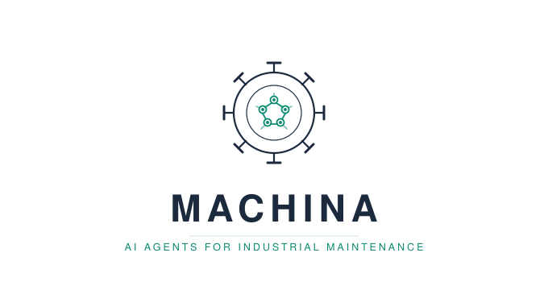
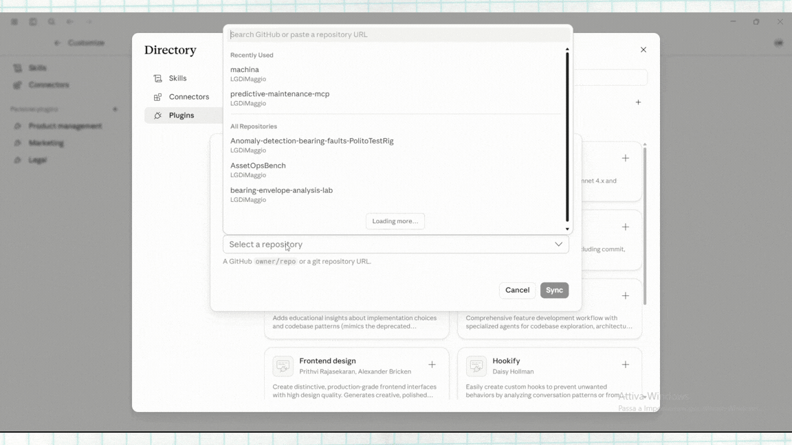

<div align="center">
  
  <h1>Machina</h1>
  <p><strong>Build AI agents for industrial maintenance in a few lines of Python.</strong></p>
  <p>
    <a href="https://opensource.org/licenses/Apache-2.0"></a>
    <a href="https://www.python.org/downloads/"></a>
    <a href="https://pypi.org/project/machina-ai/"></a>
    <a href="https://github.com/LGDiMaggio/machina/actions"></a>
    <a href="https://pypi.org/project/machina-ai/"></a>
    <a href="https://doi.org/10.5281/zenodo.19456867"></a>
  </p>
  <p>
    <a href="#quick-start">Quick Start</a> &bull;
    <a href="#what-you-can-build">Examples</a> &bull;
    <a href="#why-machina">Why Machina</a> &bull;
    <a href="https://machina-ai.readthedocs.io">Docs</a> &bull;
    <a href="#contributing">Contributing</a>
  </p>
  <br/>
  
</div>

<div align="center">
  
</div>

---

## Quick Start

```bash
pip install machina-ai[litellm,docs-rag]
git clone https://github.com/LGDiMaggio/machina.git
cd machina/examples/quickstart
python agent.py
```

> **LLM provider required.** Choose one:
>
> | Provider | Setup |
> |----------|-------|
> | **Ollama** (local, free) | Install from [ollama.com](https://ollama.com), then `ollama pull llama3` |
> | **OpenAI** | `export OPENAI_API_KEY=sk-...` |
> | **Anthropic** | `export ANTHROPIC_API_KEY=sk-ant-...` |
>
> Override the default with `python agent.py --llm openai:gpt-4o` or `--llm anthropic:claude-sonnet-4-20250514`.

The agent is built in 13 lines:

```python
from pathlib import Path

from machina import Agent, Plant
from machina.connectors.cmms import GenericCmmsConnector
from machina.connectors.docs import DocumentStoreConnector
from machina.connectors.comms.cli import CliChannel

SAMPLE_DIR = Path(__file__).resolve().parent.parent / "sample_data"

agent = Agent(
    name="Maintenance Assistant",
    plant=Plant(name="Demo Plant"),
    connectors=[
        GenericCmmsConnector(data_dir=SAMPLE_DIR / "cmms"),
        DocumentStoreConnector(paths=[SAMPLE_DIR / "manuals"]),
    ],
    channels=[CliChannel()],
    llm="ollama:llama3",  # or "openai:gpt-4o", "anthropic:claude-sonnet"
)
agent.run()
```

Sample data included: 6 assets, 5 work orders, 6 spare parts, 10 failure modes, 2 equipment manuals. Your technicians can now talk to their plant data. An example session, abridged (the wording depends on the model):

```
You: What is the bearing replacement procedure for pump P-201?

Agent: From the Grundfos CR 32-2 manual for P-201 [1]:
1. Lock out / tag out the motor and verify zero energy state
2. Disconnect the coupling, remove the bearing housing covers (4x M12 bolts)
3. Pull the old bearings; clean the shaft journals and inspect for scoring
4. Heat the new bearings to 110 °C with an induction heater and slide them on
5. Let them cool naturally; pack the housings with SKF LGMT 3 grease
6. Refit the covers (80 Nm, star pattern), check alignment, reconnect the coupling
7. Start up and verify: vibration < 2.5 mm/s, bearing temperature < 60 °C after 1 h
Parts: 2x SKF 6310 bearing (4 in stock).

— Sources:
  • [1] pump_p201_manual.md

You: Are there open work orders on that pump?

Agent: Yes, two on P-201, both in status "created":
  WO-2026-1842 | corrective | high   | Excessive vibration on the DE bearing, probable bearing wear
  WO-2026-1840 | preventive | medium | Quarterly pump inspection

You: Create a work order for bearing replacement on P-201, priority HIGH

⚠️  Create a work order?
  • Asset: P-201
  • Type: corrective
  • Priority: high
  • Description: Replace the drive-end bearings (SKF 6310) following the manual procedure; elevated vibration on the drive-end bearing.
Confirm? [y/N] y

Agent: Created work order WO-AUTO-0B2E8887 on P-201 (corrective, priority high).
```

The agent resolves "pump P-201" to the actual asset, retrieves its work orders and spare parts from your CMMS, searches the manuals via RAG (with citations), and asks before it writes anything. Answer quality depends on the model: small local models (8B) are noticeably less reliable -- in test runs they sometimes returned a tool instruction instead of an answer, or misread the retrieved context -- so use a hosted or larger model when accuracy matters.

Try it now: `cd examples/quickstart && python agent.py` -- [full quickstart guide](examples/quickstart/)

### Now Make It Automate

Add one line to register a workflow. The agent handles alarms end-to-end:

```python
from machina.workflows.builtins import alarm_to_workorder

agent = Agent(
    connectors=[cmms, docs],
    workflows=[alarm_to_workorder],  # alarm → diagnosis → WO → notify
    sandbox=True,
)
```

```
  Alarm:  ALM-2026-0412-001  |  Asset: P-201
  vibration_velocity_mm_s = 7.8 (threshold: 6.0)

  Result: SUCCESS (0.00s)
    [+] analyze_alarm        BEAR-WEAR-01 (medium), IMP-EROSION-01 (medium), BELT-WEAR-01 (medium)
    [+] check_history        none
    [+] check_spare_parts    SKF-6310 (stock 4), SEAL-CR32-KIT (stock 1)
    [+] generate_work_order  WO-AUTO-3B717CA0: corrective, priority medium, failure mode BEAR-WEAR-01
    [+] notify_technician    sandbox: intercepted, not executed
    [+] submit_work_order    sandbox: intercepted, not executed
```

6 steps, all deterministic -- domain services and connector calls, no LLM call -- so they are fast, predictable and testable; in sandbox mode the notification and the CMMS submit are intercepted. Try it: `cd examples/alarm_to_workorder && python agent.py` -- [full guide](examples/alarm_to_workorder/)

### Or configure via YAML

For knowledge-base agents (Q&A over CMMS data, manuals, spare parts), you can skip Python entirely and configure via YAML:

```yaml
name: "Maintenance Assistant"
plant:
  name: "North Plant"
connectors:
  cmms:
    type: generic_cmms
    settings:
      data_dir: "./sample_data/cmms"
  docs:
    type: document_store
    settings:
      paths: ["./sample_data/manuals"]
channels:
  - type: cli
llm:
  provider: "ollama:llama3"
```

```python
from machina import Agent

agent = Agent.from_config("machina.yaml")
agent.run()
```

YAML config is ideal for knowledge-base agents — technician Q&A, document search, asset lookup. For agents with automated workflows (alarm response, predictive pipelines), use Python — workflows need logic (guards, error policies, LLM reasoning steps) that YAML can't express. See the [YAML config guide](examples/reference/yaml_config/) for details.

## What You Can Build

Two examples take you from zero to automation. Then deploy with the starter kit.

| Step | Example | What happens |
|------|---------|--------------|
| **1. Understand** | [quickstart/](examples/quickstart/) | Agent answers questions about equipment, procedures, spare parts, maintenance history |
| **2. Automate** | [alarm_to_workorder/](examples/alarm_to_workorder/) | Alarm fires -- agent diagnoses failure, checks parts, creates work order, notifies team |
| **3. Deploy** | [odl-generator-from-text/](templates/odl-generator-from-text/) | Free-text requests become confirmed Work Orders in a spreadsheet (or REST CMMS). Starter kit, sandbox-first |

The LLM-driven examples default to `ollama:llama3` -- local, free, no API key needed. Override: `--llm openai:gpt-4o`. The alarm workflow needs no LLM at all.

**More patterns** in [examples/reference/](examples/reference/): predictive pipelines, CMMS portability, custom workflows, YAML config, autonomous agents.

## Starter Kit

Ready to adapt? The **odl-generator-from-text** template is a copy-configure-run starter kit:

```bash
cp -r templates/odl-generator-from-text my-agent
cd my-agent
pip install "machina-ai[excel,litellm,examples]"
cp .env.example .env        # set your LLM model and key
python agent.py --sandbox   # or: docker compose run --rm machina
```

A technician describes a problem in their language:

> *Italian:* `"pompa P-201 perde acqua, caldaia C-3 rumore anomalo, prego creare OdL"`
> *English:* `"pump P-201 leaking water, boiler C-3 abnormal noise, please create WO"`

The agent resolves the assets against the registry, proposes one work order per asset, and — in live mode, after you confirm each one — appends them to a spreadsheet or a REST CMMS. [Full template guide &rarr;](templates/odl-generator-from-text/)

## Build with Claude Code

Machina ships a **Claude Code plugin** — `machina-agent-builder` — that makes the framework LLM-buildable. Instead of wiring an agent by hand, you drive two slash commands and Claude reads Machina's **code-derived self-description spine** (`machina describe`) to assemble a working agent from what the framework actually supports:

- **`/build-machina-agent`** — reads the spine, confirms the shape with you, then generates a `config.yaml` + entrypoint wiring only the capabilities the spine reports as backed.
- **`/extend-machina`** — adds a connector, capability, MCP tool, mapper, or workflow against the seam the spine declares, then regenerates the spine so the CI drift gate stays green.

Because both commands consume the live spine rather than a hardcoded list, the plugin never goes stale as Machina changes. The repo doubles as a Claude Code **plugin marketplace**, so installing it is two slash commands:

```text
/plugin marketplace add LGDiMaggio/machina
/plugin install machina-agent-builder@machina
```

<div align="center">
  
</div>

> **Prerequisite** — the commands run `machina describe`, so `machina-ai` must be installed in the environment where you use the plugin. See the [plugin guide](plugin/README.md) for the full walkthrough (local-checkout install, why it stays in sync).

## From Demo to Production

The quickstart uses sample data. When you're ready, swap connectors to your real systems -- the agent logic doesn't change:

```python
# Demo (quickstart)                              # Production
GenericCmmsConnector(data_dir="./sample/")  -->   SapPM(url="https://sap.company.com/odata/v4", auth=...)
                                                  Maximo(url="https://maximo.company.com/oslc", auth=...)
DocumentStoreConnector(paths=["./manuals/"])-->   DocumentStoreConnector(paths=["/shared/manuals/"])
CliChannel()                               -->   Telegram(bot_token="...")
"ollama:llama3"                            -->   "openai:gpt-4o"
```

Add sensors when you need predictive maintenance:

```python
from machina.connectors import OpcUA, MQTT

agent = Agent(
    connectors=[cmms, docs, OpcUA(endpoint="opc.tcp://plc:4840", ...)],
    workflows=[alarm_to_workorder],
    llm="openai:gpt-4o",
)
```

Same agent, same workflows. Just more data flowing in.

## Why Machina?

Building an AI maintenance agent today means writing custom connectors for SAP PM, handling OPC-UA subscriptions, defining domain concepts from scratch, and engineering prompts that understand maintenance -- before writing a single line of business logic. **That takes months.**

Machina provides the missing vertical layer between general-purpose frameworks (LangChain, CrewAI) and the industrial maintenance world:

- **Pre-built connectors** for CMMS, IoT sensors, communication platforms, and document stores
- **Canonical maintenance domain model** -- Asset, WorkOrder, FailureMode, SparePart, Alarm with hierarchies and validation
- **Domain-aware AI** -- agents that resolve equipment references, inject maintenance context, and ground answers in real data
- **Rule-based + LLM intelligence** -- deterministic services (`FailureAnalyzer`, `WorkOrderFactory`, `MaintenanceScheduler`) work alongside the LLM, not instead of it
- **Workflow engine** -- composable multi-step workflows with error policies, guard conditions, and sandbox mode
- **LLM-agnostic** -- OpenAI, Anthropic, Mistral, Llama, Ollama, and any LiteLLM-compatible provider
- **Sandbox mode** -- test everything safely with a log-only runtime before connecting real systems

### How It Works Under the Hood

When a user asks *"What's wrong with pump P-201?"*, the agent:

1. **Resolves entities** -- "the pump" or "P-201" maps to the actual Asset in the registry, with its failure modes and criticality; when the match is weak or ambiguous, the agent asks which asset you mean instead of guessing
2. **Gathers context** -- once the asset is resolved, its work orders, compatible spare parts and relevant manual excerpts (RAG) are fetched concurrently, each from the first connector that provides it
3. **Grounds the LLM** -- the retrieved context (real asset data, real inventory, real history) is injected into the prompt, so the LLM reasons over your data rather than its guesses
4. **Takes action** -- the LLM calls tools for look-ups, diagnosis and work-order creation; every write asks for your confirmation by default and is a no-op in sandbox mode. Workflows run the same kind of work as fixed steps -- rule-based diagnosis, spare-part checks, work-order drafting -- and can add LLM reasoning steps where judgment is needed

<details>
<summary><strong>Connector Matrix</strong></summary>

### CMMS

| Connector | System | |
|-----------|--------|---|
| `GenericCmms` | Any REST-based CMMS (configurable via schema mapping) | Available |
| `SapPM` | SAP Plant Maintenance (OData v2/v4, OAuth2 + Basic Auth) | Available |
| `Maximo` | IBM Maximo (OSLC/JSON, API key + Basic + Bearer) | Available |
| `UpKeep` | UpKeep CMMS (REST API v2, Session-Token) | Available |
| `MaintainX` | MaintainX | Planned |
| `Limble` | Limble CMMS | Planned |
| `Fiix` | Fiix (Rockwell) | Planned |

### Spreadsheets & Databases

| Connector | Source | |
|-----------|--------|---|
| `ExcelCsvConnector` | Excel (`.xlsx`) and CSV files, mapped column by column | Available |
| `GenericSqlConnector` | SQL databases over ODBC/JDBC, mapped query by query | Available |

### IoT & Industrial Protocols

| Connector | Protocol | |
|-----------|----------|---|
| `OpcUA` | OPC-UA | Available |
| `MQTT` | MQTT / Sparkplug B (JSON payloads only -- protobuf needs an MQTT-to-JSON bridge) | Available |
| `Modbus` | Modbus TCP/RTU | Planned |

### Communication & Scheduling

| Connector | Platform | |
|-----------|----------|---|
| `Telegram` | Telegram Bot API | Available |
| `Slack` | Slack Bolt SDK (Socket Mode) | Available |
| `Email` | SMTP / IMAP (+ Gmail API) | Available |
| `Calendar` | Google Calendar / Outlook / iCal | Available |
| `WhatsApp` | WhatsApp Business Cloud API | Planned |
| `Teams` | Microsoft Graph API | Planned |

### Documents & Knowledge

| Connector | Source | |
|-----------|--------|---|
| `DocumentStore` | PDF / DOCX with RAG (LangChain + ChromaDB) | Available |

</details>

## Architecture

```
                    +---------------------------+
                    |   Claude / Cursor / MCP   |
                    +-------------+-------------+
                                  | MCP Protocol
+------------------------------------------------------+
|              YOUR APPLICATION                         |
|  +---------------------+  +------------------------+ |
|  |    AGENT LAYER       |  |    MCP SERVER LAYER    | |
|  | Runtime + Workflows  |  |  (tools gated by       | |
|  | Domain Prompting     |  |   connector caps)      | |
|  +----------+-----------+  +-----------+------------+ |
+-----------+----------------------------+--------------+
|                    DOMAIN LAYER                        |
|  Asset . WorkOrder . FailureMode . SparePart . Alarm  |
+-------------------------------------------------------+
|                  CONNECTOR LAYER                       |
|  CMMS . Excel/SQL . IoT . Messaging . Documents       |
+-------------------------------------------------------+
|                    CORE LAYER                          |
|      LLM Abstraction . Config . Observability         |
+-------------------------------------------------------+
```

<details>
<summary><strong>Domain Model</strong></summary>


The domain model is the backbone of Machina. Every connector normalizes external data into domain entities, the agent reasons in domain terms, and LLM prompts are grounded in domain context.

**Why this matters:**

- **Portability** -- Switch CMMS backends, your agent logic doesn't change
- **Deterministic logic where it counts** -- FailureAnalyzer, WorkOrderFactory, MaintenanceScheduler encode expertise as code, not LLM guesses
- **LLM grounding** -- the LLM works with real, validated data (failure codes, maintenance history, inventory levels), not hallucinated IDs
- **Industry-aligned taxonomy** -- failure modes and equipment classes follow established industrial standards

```python
from machina.domain import Asset, AssetType, FailureMode

pump = Asset(
    id="P-201",
    name="Cooling Water Pump",
    type=AssetType.ROTATING_EQUIPMENT,
    criticality="A",
    equipment_class_code="PU",  # ISO 14224 Table A.4
)

bearing_wear = FailureMode(
    code="BEAR-WEAR-01",
    iso_14224_code="VIB",       # ISO 14224 Annex B Table B.15
    name="Bearing Wear",
    mechanism="fatigue",
    typical_indicators=["vibration_velocity_mm_s", "bearing_temperature_c"],
    recommended_actions=["replace_bearing", "check_alignment"],
)
```

The full domain includes: `Asset` (hierarchical trees), `WorkOrder` (lifecycle management), `FailureMode` (ISO 14224 taxonomy), `SparePart` (inventory tracking), `Alarm` (severity-based), `MaintenancePlan` (scheduling), plus three domain services that provide rule-based intelligence alongside the LLM.

</details>

<details>
<summary><strong>Workflow Engine</strong></summary>

Build multi-step maintenance workflows that mix deterministic steps with LLM reasoning:

```python
from machina.workflows import Workflow, Step, Trigger, TriggerType, ErrorPolicy

alarm_to_workorder = Workflow(
    name="Alarm to Work Order",
    trigger=Trigger(type=TriggerType.ALARM, filter={"severity": ["critical"]}),
    steps=[
        Step("diagnose", action="failure_analyzer.diagnose",
             on_error=ErrorPolicy.STOP),
        Step("check_history", action="cmms.read_maintenance_history",
             inputs={"asset_id": "{trigger.asset_id}"},
             on_error=ErrorPolicy.SKIP),
        Step("create_wo", action="work_order_factory.create",
             on_error=ErrorPolicy.STOP),
        Step("notify", action="channels.send_message",
             template="WO created for {trigger.asset_id}: {diagnose}",
             on_error=ErrorPolicy.NOTIFY),
    ],
)

agent = Agent(workflows=[alarm_to_workorder], sandbox=True)
result = await agent.trigger_workflow("Alarm to Work Order", {"asset_id": "P-201"})
```

Or use the built-in template: `from machina.workflows.builtins import alarm_to_workorder`

Features: error policies (retry/skip/stop/notify), guard conditions, template variables (`{trigger.*}`, `{step_name}`), sandbox mode, and step tracing via ActionTracer. A workflow's trigger (alarm, schedule, manual, condition) describes the event it handles; you start a run with `agent.trigger_workflow(...)`, or the agent does through its `execute_workflow` tool.

</details>

<details>
<summary><strong>MCP Server</strong></summary>

Expose your connectors as an MCP server -- let Claude Desktop, Cursor, or any MCP client query your CMMS, spreadsheets and manuals directly:

```bash
pip install "machina-ai[mcp]"
machina mcp serve --config machina.yaml
```

Ask Claude: *"What's the maintenance history for pump P-201?"* -- and it queries your CMMS (SAP PM, Maximo, UpKeep, a REST API or a spreadsheet) through Machina's MCP server. No agent code required.

The server registers tools only for the capabilities your connectors declare (15 domain tools, plus 2 opt-in vendor tools), together with 4 resources and 3 prompt templates. It runs over stdio for a local client, or over streamable HTTP with bearer-token auth for shared deployments; writes respect sandbox mode. See the [MCP docs](docs/mcp-server.md).

</details>

## Roadmap

**v0.1** -- Core domain model, CMMS connectors (SAP PM, Maximo, UpKeep), DocumentStore with RAG, Telegram, Agent runtime, CI/CD

**v0.2** -- Workflow engine, IoT connectors (OPC-UA, MQTT), Slack, Email, Calendar, sandbox mode, security hardening

**v0.3** -- MCP server layer, typed connector capabilities, Excel/CSV and SQL substrates, Generic CMMS YAML mapper, deployment story, starter kit; v0.3.1 added write-path safety and the RAG upgrade

**v0.4** *(current)* -- Runnable MCP server (`machina mcp serve`, stdio and streamable HTTP), human-in-the-loop write confirmation and resolution-authority gates, failure-mode catalogs as a capability, YAML-buildable substrates, documentation checked against the code

**v0.5** *(next)* -- MaintainX/Limble/Fiix connectors, WhatsApp and Teams, anomaly detection and RUL estimation, multi-agent orchestration

Details in the [roadmap](docs/roadmap.md) and the [changelog](CHANGELOG.md).

## Citing Machina

If you use Machina in your research, please cite the software:

```bibtex
@software{dimaggio_machina_2026,
  author    = {Di Maggio, Luigi Gianpio},
  title     = {{Machina: An AI Agent Framework for Industrial Maintenance}},
  version   = {0.4.0},
  year      = {2026},
  publisher = {Zenodo},
  doi       = {10.5281/zenodo.19456867},
  url       = {https://github.com/LGDiMaggio/machina}
}
```

[10.5281/zenodo.19456867](https://doi.org/10.5281/zenodo.19456867) is the concept DOI: it always resolves to the latest version, and the Zenodo record lists the DOI of each release for citing a specific one. GitHub's "Cite this repository" button reads [`CITATION.cff`](CITATION.cff).

## Contributing

We welcome contributions! See [CONTRIBUTING.md](CONTRIBUTING.md) for the full guide.

```bash
git clone https://github.com/LGDiMaggio/machina.git
cd machina
pip install -e ".[dev,all]"
make ci   # lint + typecheck + spine drift check + tests
```

## Community & Support

- [GitHub Discussions](https://github.com/LGDiMaggio/machina/discussions) -- Ask questions, share ideas, show what you've built
- [Issues](https://github.com/LGDiMaggio/machina/issues) -- Report bugs and request features

## License

Apache License 2.0. See [`LICENSE`](LICENSE).

## Acknowledgments

[LiteLLM](https://github.com/BerriAI/litellm) | [LangChain](https://github.com/langchain-ai/langchain) | [asyncua](https://github.com/FreeOpcUa/opcua-asyncio) | [ChromaDB](https://github.com/chroma-core/chroma) | [structlog](https://github.com/hynek/structlog) | [MCP SDK](https://github.com/modelcontextprotocol/python-sdk)
